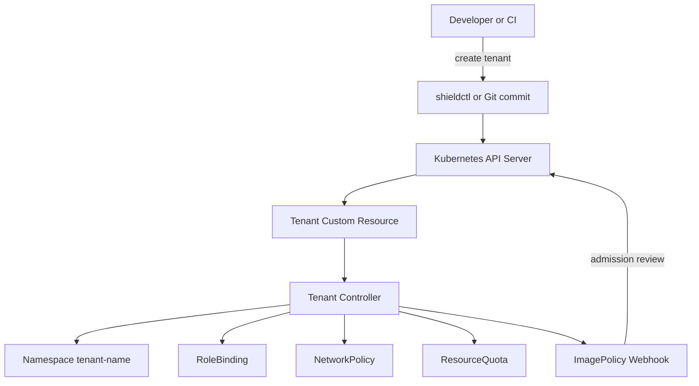

# ShieldX Tenant Platform — Kiến trúc + Quy trình (Tổng hợp)

> **Mục đích tài liệu:** Kết hợp **Kiến trúc hệ thống** và **Quy trình xây dựng - triển khai** thành một guide duy nhất, vừa đủ chi tiết để dev team bắt tay code, vừa đủ hệ thống để làm playbook vận hành.

---

## 1. Executive summary

ShieldX Tenant Platform (gọi tắt `shieldx-platform`) là một **Internal Developer Platform (IDP)** chạy trên Kubernetes, cho phép dev/team tạo môi trường đầy đủ, an toàn, và có governance chỉ bằng 1 lệnh CLI hoặc 1 CR file. Nguồn sự thật là **Tenant CRD**. Controller chịu trách nhiệm chuyển Tenant → tài nguyên Kubernetes (Namespace, RBAC, NetworkPolicy, ResourceQuota, labels để kích hoạt ImagePolicy webhook...).

Tài liệu này mô tả:

* Kiến trúc tổng thể
* Data model (CRD)
* Luồng reconcile chi tiết (pseudo-code)
* Template tài nguyên (NetworkPolicy, Quota, RoleBinding)
* UX: CLI + GitOps
* Quy trình phát triển theo Sprint + kiểm thử + vận hành

---

## 2. Kiến trúc tổng thể (Architecture)

### 2.1 Thành phần chính

* **Tenant CRD** — Abstraction: owner, tier, isolation
* **Tenant Controller** — Reconcile, Self-healing, Ownership/Watch
* **Image Policy Webhook** — Enforcement (Cosign/sigstore) — sử dụng label từ controller
* **shieldctl (CLI)** — UX cho developers
* **GitOps (optional)** — Tenant CR có thể commit vào repo (ArgoCD / Flux)
* **Observability stack** — Prometheus, Grafana, EFK/Datadog logs

### 2.2 Sơ đồ luồng (Mermaid)



### 2.3 Quy tắc thiết kế

* **Secure-by-default:** deny-all network, enforce signed images, least-privilege RBAC
* **Declarative:** Desired state = Tenant CR
* **Idempotent Reconciliation:** mỗi lần reconcile là một "audit" và có thể chạy nhiều lần
* **Separation of concerns:** Controller quản lý resources & labels; Webhook thực hiện enforcement runtime

---

## 3. Data Model — Tenant CRD

```yaml
apiVersion: platform.shieldx.io/v1alpha1
kind: Tenant
metadata:
  name: payment-team
spec:
  owners:
    - alice@company.com
    - bob@company.com
  tier: Gold        # Gold | Silver | Bronze
  isolation: Strict # Strict | Shared
  network:
    allowOutbound: false # override (careful)
  quotas: # optional overrides
    cpu: "10"
    memory: "32Gi"
```

### Giải thích

* `owners`: list emails (sẽ map sang Subject của RBAC, có thể là OIDC group)
* `tier`: determines ResourceQuota + LimitRange
* `isolation`: Strict = deny-all ingress/egress except intra-namespace; Shared = allow limited cross-namespace via NetworkPolicy
* `network.allowOutbound`: optional để cung cấp controlled egress

### Status (Suggestion)

```yaml
status:
  phase: Pending | Ready | Error
  namespace: tenant-payment-team
  conditions:
    - type: NamespaceReady
      status: "True"
    - type: NetworkPolicyReady
      status: "True"
```

---

## 4. Tenant Controller — Luồng Reconcile chi tiết

### 4.1 Các resources "Owned" (child resources)

* `Namespace` -> name: `tenant-<tenant.Name>`
* `RoleBinding` -> name: `tenant-admins` (Role: namespace-admin) hoặc ClusterRoleBinding nếu cần
* `NetworkPolicy` -> name: `default-deny` / `strict-isolation`
* `ResourceQuota` -> name: `quota-tier-<tier>`
* `LimitRange` -> name: `limits-tier-<tier>`
* `ConfigMap`/`Secret` -> nếu cần để lưu policy metadata
* Labels: `security.shieldx.io/policy: enforce`

> Controller phải `SetControllerReference(tenant, child, scheme)` cho tất cả child resources

### 4.2 Reconcile pseudo-code (chi tiết)

```go
func (r *TenantReconciler) Reconcile(ctx context.Context, req ctrl.Request) (ctrl.Result, error) {
  var tenant platformv1.Tenant
  if err := r.Get(ctx, req.NamespacedName, &tenant); err != nil {
    if apierrors.IsNotFound(err) {
      // Tenant deleted -> nothing to do (GC will remove owned resources)
      return ctrl.Result{}, nil
    }
    return ctrl.Result{}, err
  }

  // 1. Ensure namespace
  nsName := fmt.Sprintf("tenant-%s", tenant.Name)
  ns := &corev1.Namespace{ObjectMeta: metav1.ObjectMeta{Name: nsName}}
  if _, err := ctrl.CreateOrPatch(ctx, r.Client, ns, func() error {
    // set labels/annotations
    return controllerutil.SetControllerReference(&tenant, ns, r.Scheme)
  }); err != nil {
    r.recorder.Event(&tenant, "Warning", "NamespaceFailed", err.Error())
    return ctrl.Result{RequeueAfter: time.Minute}, err
  }

  // 2. Ensure RoleBinding for owners
  // map tenant.spec.owners -> subjects

  // 3. Ensure NetworkPolicy
  // choose template by tenant.spec.isolation

  // 4. Ensure ResourceQuota & LimitRange

  // 5. Ensure label to trigger ImagePolicy Webhook

  // 6. Update status

  return ctrl.Result{}, nil
}
```

### 4.3 Event handling & Watches

Trong `SetupWithManager`:

```go
ctrl.NewControllerManagedBy(mgr).
  For(&platformv1.Tenant{}).
  Owns(&corev1.Namespace{}).
  Owns(&netv1.NetworkPolicy{}).
  Owns(&rbacv1.RoleBinding{}).
  Complete(r)
```

**Ý nghĩa:** khi child resource bị thay đổi (kubectl edit), Controller sẽ nhận event và reconcile tenant — điều này giải thích cách revert xảy ra ngay lập tức.

---

## 5. Templates chi tiết (NetworkPolicy, ResourceQuota, RoleBinding)

### 5.1 NetworkPolicy — Strict (deny all except intra-namespace)

```yaml
apiVersion: networking.k8s.io/v1
kind: NetworkPolicy
metadata:
  name: strict-isolation
  namespace: tenant-payment-team
spec:
  podSelector: {}
  policyTypes:
    - Ingress
    - Egress
  ingress:
    - from:
      - podSelector: {} # same namespace
  egress:
    - to:
      - podSelector: {} # same namespace
```

> Optionally: allow DNS egress to kube-dns or HTTP proxy if needed (whitelist)

### 5.2 ResourceQuota — Gold example

```yaml
apiVersion: v1
kind: ResourceQuota
metadata:
  name: quota-tier-Gold
  namespace: tenant-payment-team
spec:
  hard:
    requests.cpu: "10"
    requests.memory: "32Gi"
    limits.cpu: "20"
    limits.memory: "64Gi"
    pods: "100"
```

### 5.3 RoleBinding — Owners as namespace-admins

```yaml
apiVersion: rbac.authorization.k8s.io/v1
kind: RoleBinding
metadata:
  name: tenant-admins
  namespace: tenant-payment-team
subjects:
  - kind: User
    name: alice@company.com
    apiGroup: rbac.authorization.k8s.io
roleRef:
  kind: ClusterRole
  name: admin
  apiGroup: rbac.authorization.k8s.io
```

> Thực tế bạn có thể tạo một `TenantAdmin` ClusterRole tùy chỉnh với scope hạn chế hơn admin.

---

## 6. Security Integration — Image Policy & Webhook

* Controller chỉ cần **gắn label** `security.shieldx.io/policy=enforce` trên namespace
* ImagePolicy Webhook (đã có) `Owns()` ClusterImagePolicy và check label trên admission request
* Webhook dùng Cosign public key để verify image digest signatures

**Lý do tách:** Controller không cần logic checksum/sigverify — single responsibility.

---

## 7. UX: shieldctl CLI & GitOps

### 7.1 shieldctl (CLI) — spec

Commands:

* `shieldctl create tenant --name NAME --tier TIER --owners a,b` => create Tenant CR
* `shieldctl status tenant NAME` => show status
* `shieldctl delete tenant NAME` => delete Tenant CR (and GC children)

Behavior:

* CLI validates input
* CLI can map `owners` (emails) -> k8s subjects via OIDC mapping (configurable)
* CLI watches Tenant.status and prints spinner + step-by-step readiness

### 7.2 GitOps flow (optional)

* Tenant CR can be created by committing YAML vào repo `infrastructure/tenants/payment-team.yaml`
* ArgoCD/Flux sync sẽ apply Tenant CR
* Controller reconcile như bình thường

**Lưu ý:** với GitOps, quyền commit cần được kiểm soát (PR reviews, CODEOWNERS)

---

## 8. CI/CD & Testing

### 8.1 Unit tests

* Reconciler unit tests bằng `envtest` (controller-runtime envtest)
* Fake client để test create/patch logic

### 8.2 Integration tests

* Spin up KinD cluster trong CI
* Apply controller image
* Apply Tenant CR và assert child resources exist
* Simulate drift (kubectl patch) và assert revert

### 8.3 E2E tests

* Full flow: shieldctl -> Tenant CR -> create namespace -> deploy sample app -> ensure image policy blocks unsigned image

---

## 9. Observability & Alerts

### Metrics

* Reconcile count, duration
* Errors per Tenant
* Resource creation failures

Expose via Prometheus metrics from Controller.

### Logging

* Structured logs (tenantName, operation, reason)
* Audit events emitted via `r.recorder.Event()`

### Alerts

* Tenant reconciliation failures > threshold
* ImagePolicy webhook failures
* Unexpected resource deletions

---

## 10. Failure Modes & Operational Runbook

### 10.1 Failure: Namespace deleted by hand

**Symptom:** Tenant.status shows NamespaceMissing
**Remediation:** Controller will re-create namespace automatically (reconcile). If it fails - check controller logs for RBAC permissions and reconcile errors.

### 10.2 Failure: NetworkPolicy edited to allow egress

**Symptom:** Security audit detects unexpected egress
**Remediation:** Controller will receive event and revert. If not, check controller permissions and ensure it's `Owns(NetworkPolicy)`

### 10.3 Failure: Webhook is down

**Symptom:** unsigned images may be allowed
**Remediation:** Alerting on webhook health. Fallback: Controller can annotate namespace as `quarantine=true` and set AdmissionPolicy to deny by default (cluster admin action)

---

## 11. Rollout Plan & Phased Deployment (safest approach)

1. **Alpha** - internal: enable platform in a non-critical namespace, only for a pilot team
2. **Beta** - extend to handful teams, enable observability & strict alerts
3. **GA** - enable for all teams; add CLI + docs + onboarding

Each phase requires: runbook, rollback plan (delete Tenant CR), and postmortem template.

---

## 12. Sprint Plan (3 Sprints) — Chi tiết task & Acceptance Criteria

### Sprint 1: Abstraction & Provisioning (2 weeks)

* Tasks:

  * Scaffold Kubebuilder project
  * Define Tenant CRD + Status
  * Implement namespace creation + OwnerReference
  * Unit tests (envtest)
* Acceptance:

  * Creating Tenant -> new namespace exists with ownerref
  * Deleting Tenant -> namespace gets removed

### Sprint 2: Isolation & Governance (2 weeks)

* Tasks:

  * Implement NetworkPolicy templates
  * Implement ResourceQuota mapping for tiers
  * Implement RoleBinding creation from `spec.owners`
  * Integration tests (KinD)
* Acceptance:

  * Tenant with `isolation:Strict` has deny-all network policy
  * Owners can create pods in namespace but external namespaces cannot access them

### Sprint 3: Developer Experience & Hardening (2 weeks)

* Tasks:

  * Build `shieldctl` CLI (create/status/delete)
  * Add status conditions + spinner UX
  * Create CI pipeline for controller image build and KinD e2e tests
  * Documentation + ADRs
* Acceptance:

  * Developer runs CLI and sees ready state
  * CI passing on new commits

---

## 13. Operational & Security Considerations

* **RBAC for Controller:** least privilege but đủ để create/patch/owner resources
* **Secrets handling:** if controller needs to write secrets, use sealed-secrets or external vault
* **Audit logging:** enable kubernetes audit logs for Tenant actions
* **Policy drift:** run periodic scans comparing Tenant.spec ↔ actual resources
* **Escalation path:** break-glass: cluster-admin can disable controller via feature-flag ConfigMap

---

## 14. Deliverables & Artefacts

* `shieldx-platform` repo with modules:

  * `api/` (Tenant types)
  * `controllers/` (reconciler)
  * `cmd/manager` (operator binary)
  * `cli/` (shieldctl)
  * `deploy/` (helm/chart, manifests)
  * `tests/` (unit/integration/e2e)
* ADR: decision on tier sizes, network model, RBAC model
* Runbook & Onboarding guide

---

## 15. Next steps (Suggested immediate tasks)

1. Scaffold repo with Kubebuilder (module layout)
2. Implement Tenant type + CRD YAML
3. Implement basic Reconcile: create namespace + ownerref + status update
4. Add unit tests with envtest for case: create tenant -> ns created

Bạn muốn mình **tạo sẵn** scaffold code (kubebuilder layout + sample reconciler) hoặc **viết pseudo-code chi tiết** cho từng task của Sprint 1? Chỉ cần chọn: `Scaffold` hoặc `Pseudo-code Sprint 1`.
